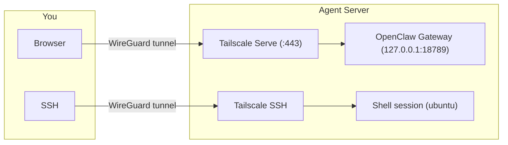

Clawup uses [Tailscale](https://tailscale.com) to create a private mesh network between you and your agents. No ports are exposed to the public internet — all access flows through an encrypted WireGuard tunnel.

## Tailscale Mesh VPN

During bootstrap, each agent installs Tailscale and joins your tailnet using a reusable auth key:

```bash
tailscale up --authkey=<key> --ssh --hostname=<stack>-<agent-name>
```

Once connected, agents are reachable by hostname on your tailnet — just like any other device.

### Hostname Pattern

Agent hostnames combine the Pulumi stack name and agent name to avoid collisions across deployments:

```
<stack>-<agent-name>.<tailnet-dns-name>
```

**Examples:**
- `dev-agent-pm.tail12345.ts.net`
- `dev-agent-eng.tail12345.ts.net`
- `prod-agent-tester.tail12345.ts.net`

## No Public Ports

All services bind to `127.0.0.1` (loopback) by default. Cloud firewalls enforce this at the network level:

| Provider | Mechanism | Default Rules |
|----------|-----------|---------------|
| AWS | Security group | All inbound blocked, all outbound allowed |
| Hetzner | Firewall | All inbound blocked |

Public SSH is disabled by default. You can opt in via `allowedSshCidrs` (AWS) or `allowedSshIps` (Hetzner), but this is not recommended — use Tailscale SSH instead.

## SSH Access

The `clawup ssh` command connects to agents through the Tailscale mesh:

```
clawup ssh
```

The CLI resolves the agent's Tailscale hostname and opens an SSH session through the encrypted tunnel. No public IP or open SSH port required — Tailscale's `--ssh` flag enables SSH access over the mesh.

## Web UI Access

Each agent runs an OpenClaw gateway that provides a web interface. Tailscale Serve proxies this over HTTPS:

```bash
# During bootstrap:
tailscale serve --bg 18789
```

This makes the OpenClaw web UI available at:

```
https://<stack>-<agent-name>.<tailnet-dns-name>/?token=<gateway-token>
```

The gateway port (default `18789`) never leaves localhost — Tailscale Serve handles TLS termination and proxies traffic from your tailnet to the local gateway.

## Token-Based Gateway Auth

Each agent gets a unique gateway token, auto-generated during provisioning from an Ed25519 keypair (SHA256 hash, first 48 characters). The token is required to access the web UI:

- Passed as a query parameter: `?token=<gateway-token>`
- Configured in `openclaw.json` as `gateway.auth.mode: "token"`
- Tokens are stored as Pulumi secrets and shown in deploy output

## End-to-End Access Flow



| Direction | Allowed? | Detail |
|-----------|----------|--------|
| Inbound from public internet | Blocked | Firewall drops all inbound traffic |
| Inbound from tailnet | SSH + HTTPS only | Tailscale Serve and Tailscale SSH |
| Outbound from agent | All | GitHub, Linear, Anthropic API, etc. |

## Security Summary

| Layer | Protection |
|-------|------------|
| Network | No public ports — firewall blocks all inbound traffic |
| Transport | WireGuard encryption via Tailscale mesh |
| Gateway | Token-based auth, binds to loopback only |
| SSH | Tailscale SSH — no password auth, no public key exposure |
| Metadata (AWS) | IMDSv2 enforced — prevents unauthenticated metadata access |
| Secrets | Pulumi encrypts API keys, tokens, and credentials at rest |
| Sandbox | Docker-based code execution isolates agent workloads |
